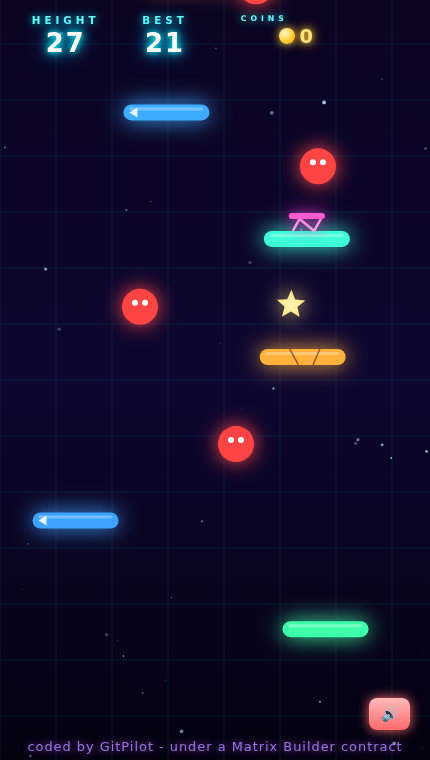

<div align="center">

<h1>🍄 Neon Climber — Under Contract</h1>
<h3>A Mario-style neon platformer — built by an <i>open</i> model, one governed batch at a time.</h3>

<p><b>openai/gpt-oss-120b</b> (running on <b>IBM watsonx.ai</b>), driven by <a href="https://gitpilot.ruslanmv.com">GitPilot</a>, wrote <code>frontend/index.html</code> across <b>6 batches</b> — and <i>only</i> that file — each bound by a <a href="https://github.com/agent-matrix/matrix-builder">Matrix Builder</a> contract and validated by <code>mb check</code> <b>before</b> it could land.</p>

<p>
  <a href="https://ruslanmv.com/doodle-jump-climber-under-contract/"></a>
  &nbsp;
  <a href="EVIDENCE.md"></a>
</p>

<p>
  
  
  
  
  
</p>



</div>

---

## 🍄 [Play it now → ruslanmv.com/doodle-jump-climber-under-contract](https://ruslanmv.com/doodle-jump-climber-under-contract/)

One self-contained HTML file. No install, no build. **Mobile + desktop** (tilt, touch, or arrows).
Bounce up neon platforms, **stomp enemies**, grab **coins + stars**, ride **springs**, use **power-ups** (shield, jetpack, magnet), and climb as high as you can.

---

## The headline: this one was built by an *open* model

The earlier games in the arcade were written by Claude Opus 4.8. **This one wasn't.** It was written by **`openai/gpt-oss-120b`** — an open-weight model — running on **IBM watsonx.ai**, through the *exact same* GitPilot + Matrix Builder loop. Same contracts, different brain. That's the whole pitch of [Matrix Builder](https://github.com/agent-matrix/matrix-builder): **the governance is provider-agnostic.** Swap the model; the allow-list, the `mb check` verdict, and the audit trail don't change.

## Built across 6 governed batches

| # | Batch | What gpt-oss-120b added | Size | Matrix Commit |
|---|---|---|---|---|
| 1 | Foundation | neon hero, jump physics, vertical camera, procedural platforms | 15 KB | `mc-f0101634a883` |
| 2 | Controls | left/right, screen-wrap, **tilt + touch + keyboard** | 22 KB | `mc-2cde9611b371` |
| 3 | Platforms + items | moving/breaking/**spring** platforms, **coins + stars** | 36 KB | `mc-511e55820933` |
| 4 | Enemies + power-ups | stompable neon enemies, **shield / jetpack / magnet** | 35 KB | `mc-cf84ff722c6e` |
| 5 | Juice | particles, trail, **parallax**, **WebAudio**, screen-shake | 41 KB | `mc-b133e1b1d466` |
| 6 | Meta | start / game-over, **high score**, difficulty ramp, boss milestone | 47 KB | `mc-8c08092f78c3` |

Every batch: `MATRIX_STATUS: approved score=100`, **zero out-of-scope edits**, headless-tested with **zero runtime errors**. Full transcript in [`EVIDENCE.md`](EVIDENCE.md).

## The loop (real commands)

```bash
pip install agent-generator gitcopilot crewai
export GITPILOT_PROVIDER=watsonx
export WATSONX_API_KEY=<your key>  WATSONX_PROJECT_ID=<your project>
export WATSONX_URL=https://us-south.ml.cloud.ibm.com
export GITPILOT_WATSONX_MODEL=openai/gpt-oss-120b
export GITPILOT_MAX_TOKENS=18000

mb init "A neon Mario-style vertical platformer, single self-contained HTML file" --quality standard
for batch in foundation controls platforms enemies juice meta; do
  mb next "$batch"
  mb prompt --coder gitpilot
  gitpilot generate -m "$(cat coder-prompts/gitpilot.md) + current file + batch spec" -o .
  mb check frontend/index.html
done
```

## Links

- 🧩 **Matrix Builder** → [agent-matrix/matrix-builder](https://github.com/agent-matrix/matrix-builder)
- 🚁 **GitPilot** → [gitpilot.ruslanmv.com](https://gitpilot.ruslanmv.com)
- 🕹️ **The rest of the arcade:** [Pong](https://github.com/ruslanmv/pong-under-contract) · [Tetris](https://github.com/ruslanmv/tetris-under-contract) · [Match-3](https://github.com/ruslanmv/match-3-under-contract) — under contract

---

<div align="center"><sub>Six batches. One file. An open model under contract. Built by <a href="https://ruslanmv.com">Ruslan Magana Vsevolodovna</a> · MIT licensed</sub></div>
